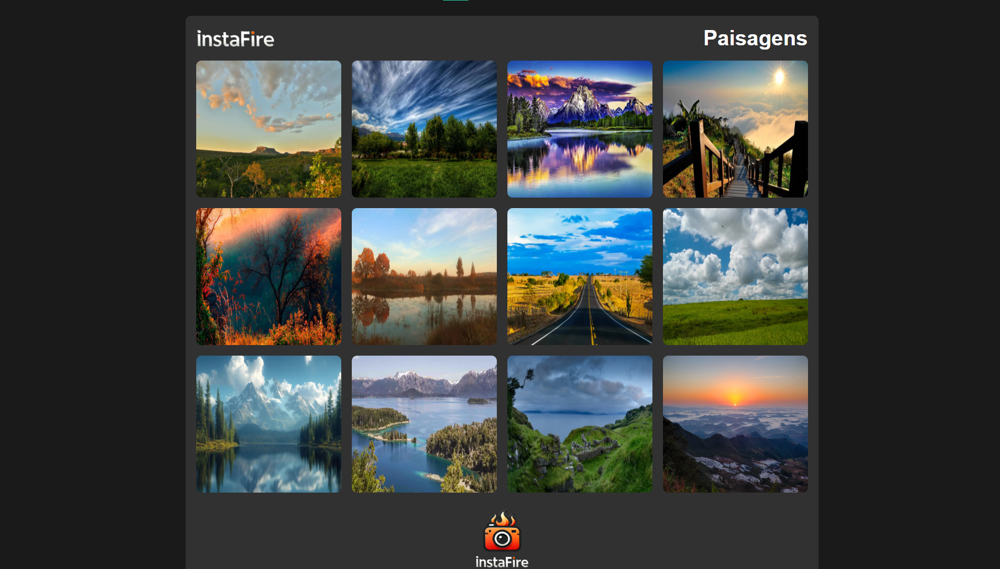
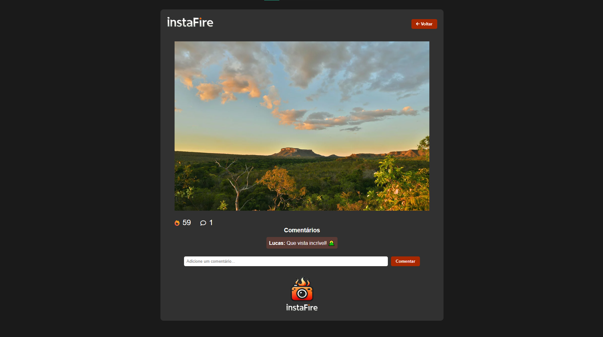

# InstaFire 

## 🔥 Sobre o Projeto

O **InstaFire** é uma aplicação inspirada no feed do Instagram, permitindo que os usuários visualizem uma galeria de fotos, curtam imagens e deixem comentários em tempo real.

## 🚀 Motivação do Nome

O nome *InstaFire* combina a ideia de imagens instantâneas (*Insta*) com o conceito de algo vibrante e dinâmico, também por utilizar recursos do Firebase (*Fire*), refletindo a energia e interação do aplicativo.

## 🖼️ Funcionalidades

- 📷 Exibição de galeria com imagens
- ❤️ Sistema de curtidas com efeito de fogo
- 💬 Comentários em tempo real
- 🔗 Integração com Firebase Firestore para armazenamento

## 🏗️ Tecnologias Utilizadas

- HTML, CSS e JavaScript
- jQuery para manipulação do DOM
- Firebase Firestore para banco de dados em tempo real
- FontAwesome para ícones

## 📸 Capturas de Tela

### 🎨 Página Inicial - Galeria


### 📷 Página da Imagem


## 📂 Estrutura do Projeto
```
InstaFire/
│── index.html  # Página inicial (galeria)
│── photo.html  # Página de exibição da imagem
│── assets/
│   ├── css/
│   │   └── styles.css  # Estilos da aplicação
│   ├── js/
│   │   ├── firebase-config.js  # Configuração do Firebase
│   │   ├── main.js  # Lógica para carregar a galeria de fotos
│   │   └── photo.js  # Lógica para curtir e comentar fotos
│   ├── img/
│   │   ├── 1.webp
│   │   ├── 2.webp
│   │   ├── ...
│   │   ├── favicon.webp
│   │   ├── logo.webp
│   │   ├── logo-text.webp
│   │   ├── screenshot-gallery.webp
│   │   └── screenshot-photo.webp
│── README.md  # Documentação
```

## 📜 Como Usar

1. Configure o Firebase no arquivo `firebase-config.js` com os dados do seu projeto firebase.
2. Crie uma coleção no Firebase Firestore com o nome "posts".
3. Use a função do arquivo arquivo posts.js para adicionar os comentários e quantidade de curtidas.
4. Abra o arquivo `index.html` no navegador.

## 💡 Visualizar online

Acesse online [clicando aqui](https://instafire.vercel.app/)
